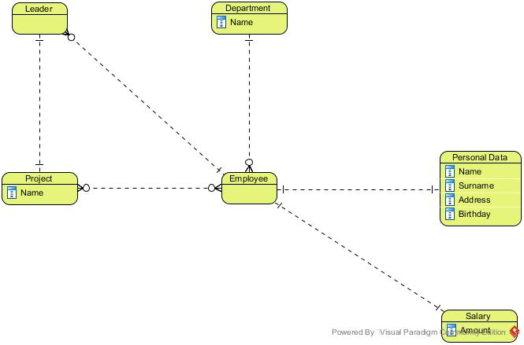
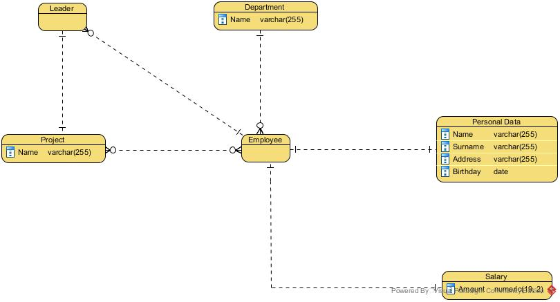
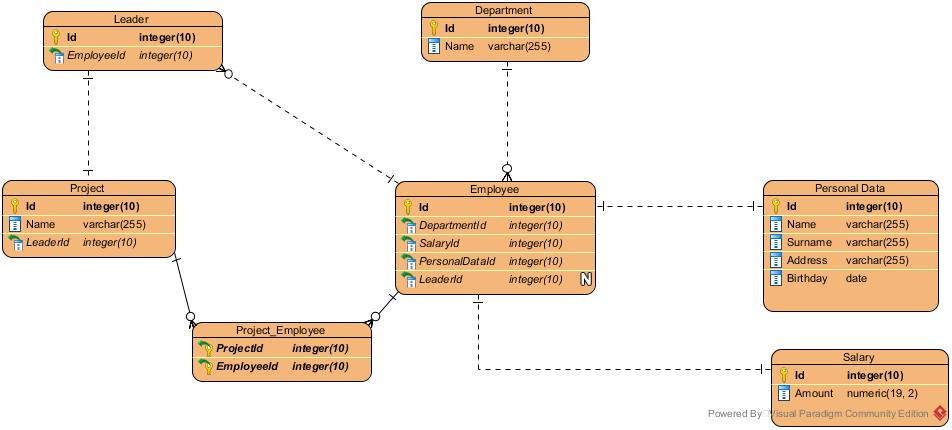
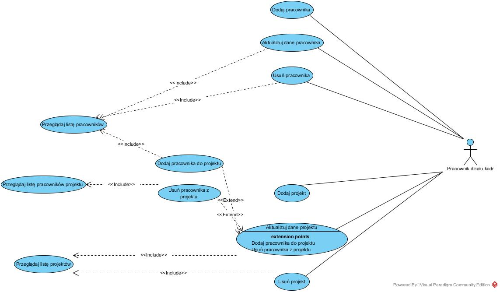
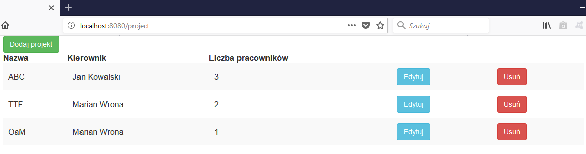
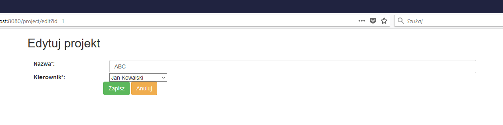
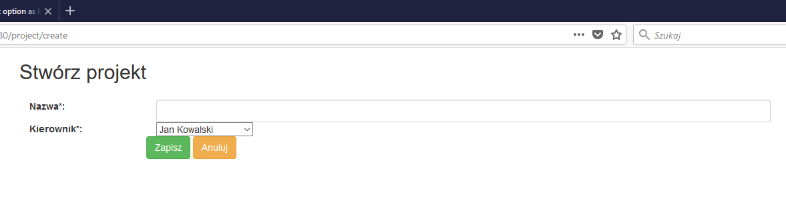

# Sprawozdanie

Jakub Dymon, Paweł Nowacki, Paweł Sulżycki

## Wstęp

### Cele projektu

Celem projektu jest stworzenie aplikacji internetowej na potrzeby działu kadr przedsiębiorstwa. Przedsiębiorstwo posiada trzy lokalizacje, a w każdej z nich znajduje się dział kadr, który potrzebuje dostępu do danych o wszystkich pracownikach firmy. Wszystkie lokalizacje są równorzędne i potrzebują zarówno odczytywać, jak i edytować dane pracowników.

### Założenia projektowe

System pozwala na dodawanie i usuwanie pracowników, przeglądanie i edycję danych osobowych pracowników i zależności hierarchicznych pomiędzy nimi. Ponadto system replikacji bazy danych pozwala na obsługę systemu z różnych oddziałów firmy rozsianych po całym świecie. System ma formę aplikacji internetowej z systemem logowania i jest dostępny dla odpowiednio przeszkolonych pracowników działu kadr. Konta użytkowników są zakładane odgórnie przez administratora.

Aplikacja wykorzystuje relacyjną bazę danych MySQL oraz logikę biznesową zaimplementowaną z użyciem języka Java i biblioteki Spring Framework oraz pochodnych. Każda instancja aplikacji posiada własną bazę danych o takich samej zawartości i jest dobierana na podstawie lokalizacji. Stosowana jest replikacja  migawkowa typu multimaster na poziomie bazy danych i służy propagacji danych pomiędzy różnymi instancjami tej samej aplikacji. Kontroli wersji danych służy mechanizm *optimistic locking*.

### Zakres projektu

## Replikacja w systemie baz danych MySQL

## Modele baz danych

### Model konceptualny



### Model logiczny



### Model fizyczny



## Implementacja baz danych w środowisku MySQL

### Opis implementacji mechanizmu replikacyjnego multi-master

Implementację mechanizmu replikacyjnego rozpoczęto od przygotowania odpowiedniego środowiska, na którym będzie działać baza danych.

#### Przygotowanie środowiska

1. Instalacja VMware Workstation 14 Player na urządzeniu - hoście z systemem Windows
2. Instalacja maszyny wirtualnej z systemem Ubuntu 16.04 LTS
3. Instalacja najnowszej wersji MySQL.
4. Powielenie maszyny wirtualnej, tak aby otrzymać łącznie 3 maszyny.
5. Konfiguracja wirtualnej sieci lokalnej w celu umożliwienia komunikacji między maszynami. 

#### Konfiguracja maszyn wirtualnych

Kolejnym krokiem było konfiguracja maszyn wirtualnych w celu umożliwienia replikacji.

1. Dla każdej z maszyn wygenerowano unikalne ID grupy przy użyciu komendy

    ```
    uuidgen
    ```
     oraz sprawdzono adres IP maszyn przy użyciu
    ```
    ifconfig
    ```
     Zapisane dane potrzebne będą do dalszej konfiguracji.

2. Następnie utworzono pliki konfiguracyjne przy użyciu komendy 

    ```
    sudo gedit /etc/mysql/my.cnf
    ```

3. Wypełnienie pliku konfiguracyjnego bazy danych według poniższego szablonu: 

    ```
    !includedir /etc/mysql/conf.d/
    !includedir /etc/mysql/mysql.conf.d/

    [mysqld]

    # General replication settings
    gtid_mode = ON
    enforce_gtid_consistency = ON
    master_info_repository = TABLE
    relay_log_info_repository = TABLE
    binlog_checksum = NONE
    log_slave_updates = ON
    log_bin = binlog
    binlog_format = ROW
    transaction_write_set_extraction = XXHASH64
    loose-group_replication_bootstrap_group = OFF
    loose-group_replication_start_on_boot = OFF
    loose-group_replication_ssl_mode = REQUIRED
    loose-group_replication_recovery_use_ssl = 1

    # Shared replication group configuration
    loose-group_replication_group_name = [wygenerowany id grupy]
    loose-group_replication_ip_whitelist = [ip serwerów oddzielone ","]
    loose-group_replication_group_seeds = [ip serwerów z portem 33061 oddzielone ","]

    # Single or Multi-primary mode? Uncomment these two lines
    # for multi-primary mode, where any host can accept writes
    loose-group_replication_single_primary_mode = OFF
    loose-group_replication_enforce_update_everywhere_checks = ON

    # Host specific replication configuration
    server_id = [id serwera]
    bind-address = 127.0.0.1
    report_host = [ip serwera]
    loose-group_replication_local_address = [ip serwera]:33061
    ```

4. Po zapisaniu pliku konfiguracyjnego należało zrestartować bazę danych przy użyciu komendy 

    ```
    sudo systemctl restart mysql
    ```

5. Kolejnym krokiem było dodanie wyjątków do zapory sytemowej:
    ```
    sudo ufw allow 33061
    ```

#### Konfiguracja wewnątrz MySQL

1. Po zalogowaniu się do bazy danych kolejnymi krokami były:

2. Utworzenie użytkownika bazy danych odpowiedzialnego za replikację

3. Instalacja pluginu umożliwiającego obsługę replikacji.

4. Po pomyślnej instalacji mechanizm replikacji był już praktycznie gotowy. Pozostało tylko utworzyć grupę baz danych:

    ```
    SET GLOBAL group_replication_bootstrap_group=ON;
    START GROUP_REPLICATION;
    SET GLOBAL group_replication_bootstrap_group=OFF;
    ```

5. Ostatnim krokiem było wystartowanie replikacji na pozostałych maszynach: 

    ```
    START GROUP_REPLICATION;
    ```

Poniżej widoczna jest tabela prezentująca bazy danych połączone w grupę replikacji:


Prezentacja działania mechanizmu replikacji dostępna jest w formie wideo pod adresem: [https://youtu.be/CZzqGOR5zJk](https://youtu.be/CZzqGOR5zJk).

### Schemat bazy danych

Schemat bazy danych jest tworzony przez mechanizm HBM2DDL biblioteki Hibernate na podstawie klas encji aplikacji klienckiej. Aby było to możliwe należało skonfigurować aplikację z użyciem pliku application.properties.

```properties
spring.datasource.url= jdbc:mysql://127.0.0.1:3306/hrs
spring.datasource.username=root
spring.datasource.password=admin
spring.datasource.driverClassName=com.mysql.jdbc.Driver
spring.jpa.show-sql=true
spring.jpa.hibernate.ddl-auto = create
spring.jpa.hibernate.naming.physical-strategy=org.springframework.boot.orm.jpa.hibernate.SpringPhysicalNamingStrategy
spring.jpa.properties.hibernate.hbm2ddl.import_files=import.sql
```

Po skonfigurowaniu aplikacji należało stworzyć klasy encji, a następnie uruchomić aplikację. Poniżej przedstawiono klasę encji reprezentującą tabelę *project*.

```java
package hrs.database.project;

import hrs.database.employee.Employee;
import lombok.Getter;
import lombok.Setter;

import javax.persistence.*;
import javax.validation.constraints.NotNull;
import java.util.Collection;

@Entity
@Getter
@Setter
public class Project {

    @Id
    @GeneratedValue
    private Long id;

    @NotNull
    private String name;

    @NotNull
    @ManyToOne
    @JoinColumn
    private Leader leader;

    @NotNull
    @ManyToMany
    @JoinTable(name = "project_employee", joinColumns = {
            @JoinColumn(name = "project_id")
    }, inverseJoinColumns = {
            @JoinColumn(name = "employee_id")
    })
    private Collection<Employee> employees;

}
```

Kolumny tabeli reprezentowane są przez pola klasy, natomiast ich typ definiuje typ zmiennej, a właściwości - adnotacje. Powyższa klasa zawiera też definicję tabeli łączącej *project_employee* zrealizowaną za pomocą adnotacji *@JoinTable*.

## Projekt i implementacja aplikacji klienckiej

### Funkcje aplikacji - diagram przypadków użycia

Aplikacja realizuje przypadki użycia przedstawione na diagramie. Zostały zaimplementowane jedynie wybrane funkcjonalności, które umożliwiają zaprezentowanie działania mechanizmu replikacji.



### Realizacja wybranych funkcjonalności

W ramach projektu zrealizowano część aplikacji odpowiedzialną za zarządzanie projektami, a więc przewidującą przypadki użycia: "dodaj projekt", "aktualizuj dane projektu" i "usuń projekt" i  ich nieodłączną część "wyszukaj projekt".

####Wyszukiwanie projektu

Jak pokazano na diagramie przypadków użycia nieodłączną częścią niektórych procesów jest wyszukiwanie projektu, które zostało zrealizowane z użyciem biblioteki Spring Data JPA.

```java
package hrs.database.project;

import org.springframework.data.jpa.repository.JpaRepository;
import org.springframework.data.jpa.repository.Query;

import java.util.List;

public interface ProjectRepo extends JpaRepository<Project, Long> {

    @Query("select new hrs.database.project.ProjectListDO(p.id, p.name, p.leader.employee.personalData.name, p.leader.employee.personalData.surname, count(e)) from Project p left join p.employees as e group by p.id, p.name")
    List<ProjectListDO> findProjects();

}
```

Wykonanie metody *findProjects* jest równoznaczne z wykonaniem zapytania JPQL podanego w adnotacji. Wartością zwracaną jest lista obiektów typu *ProjectListDO*.

```java
package hrs.database.project;

import lombok.Getter;
import lombok.NoArgsConstructor;
import lombok.Setter;

@Getter
@Setter
@NoArgsConstructor
public class ProjectListDO {

    private Long id;

    private String name;

    private String leader;

    private Long size;

    public ProjectListDO(Long id, String name, String leaderName, String leaderSurname, Long size) {
        this.id = id;
        this.name = name;
        this.leader = leaderName + ' ' + leaderSurname;
        this.size = size;
    }
}
```

Następnie lista jest udostępniana użytkownikowi przez punkt dostępu typu REST zdefiniowany w metodzie *findProjects* klasy *ProjectListResource*.

```java
package hrs.rest.employee;

import hrs.database.project.ProjectRepo;
import org.springframework.beans.factory.annotation.Autowired;
import org.springframework.stereotype.Controller;
import org.springframework.ui.Model;
import org.springframework.web.bind.annotation.RequestMapping;
import org.springframework.web.bind.annotation.RequestParam;

@Controller
@RequestMapping("/project")
public class ProjectListResource {

    @Autowired
    private ProjectRepo projectRepo;

    @RequestMapping
    public String findProjects(Model model) {
        model.addAttribute("projects", projectRepo.findProjects());
        return "project-list";
    }

}
```

Wartością zwracaną metody jest nazwa szablonu strony internetowej, która ma zostać pokazana w przeglądarce w odpowiedzi na zapytanie metodą GET na adres *\<host\>/project*. Szablon zostanie wypełniony danymi przekazanymi jako atrybut modelu o nazwie *projects*. Za połączenie modelu i widoku odpowiada biblioteka Thymeleaf. W szablonie zastosowano także bibliotekę Bootstrap, dostarczającą gotowych komponentów.

```html
<html xmlns="http://www.w3.org/1999/xhtml"
      xmlns:th="http://www.thymeleaf.org"
>
<head>
    <meta charset="utf-8"/>
    <title>HRS</title>
    <link th:href="@{~/bootstrap/css/bootstrap.min.css}" rel="stylesheet">
    <link th:href="@{~/css/main.css}" rel="stylesheet">
</head>
<body>
<div class="container">
    <div class="row">
        <div class="col-md-12">
            <a href="/project/create" class="btn btn-success" role="button">Dodaj projekt</a>
        </div>
    </div>
    <div class="row">
        <div class="col-md-12">
            <table class="table-striped">
                <thead>
                <th>Nazwa</th>
                <th>Kierownik</th>
                <th>Liczba pracowników</th>
                <th></th>
                <th></th>
                </thead>
                <tbody>
                <tr th:each="project : ${projects}">
                    <td th:text="${project.name}"></td>
                    <td th:text="${project.leader}"></td>
                    <td th:text="${project.size}"></td>
                    <td>
                        <a th:href="'/project/edit?id=' + ${project.id}" class="btn btn-info" role="button">Edytuj</a>
                    </td>
                    <td>
                        <a th:href="'/project/remove?id=' + ${project.id}" class="btn btn-danger" role="button">Usuń</a>
                    </td>
                </tr>
                </tbody>
            </table>
        </div>
    </div>
    <script th:src="@{~/jquery/jquery-3.2.1.min.js}"></script>
    <script th:src="@{~/bootstrap/js/bootstrap.min.js}"></script>
</div>
</body>
</html>
```

Po otwarciu adresu [http://localhost:8080/project](http://localhost:8080/project) można przeglądać listę projektów.



#### Usuwanie projektów

Jak można zauważyć w kodzie szablonu naciśnięcie przycisku *Usuń* wywoła wysłanie zapytania typu GET na adres *\<host\>/project?remove=\<id\>*, gdzie *id* zostanie zastąpione odpowiednią wartością. Aby możliwe było odebranie zapytania, należało zdefiniować w klasie *ProjectListResource* kolejny punkt dostępu, reprezentowany metodą *removeProject*.

```java
@RequestMapping("/remove")
public String removeProject(@RequestParam("id") Long id){
  projectRepo.delete(id);
  return "redirect:/project";
}
```

Metoda przyjmuje id jako parametr i usuwa z bazy odpowiedni rekord z pomocą metody *delete* zdefiniowanej w klasie *ProjectRepo* przez interfejs *JpaRepository* pochodzący z biblioteki Spring Data JPA. Nie trzeba więc tworzyć zapytania samodzielnie. Po wykonaniu usuwania aplikacja przekierowuje na adres *\<host\>/project*, gdzie użytkownik może zobaczyć zaktualizowaną listę projektów.

#### Edytowanie danych projektu

Aby możliwe było edytowanie danych projektu należało stworzyć nowy szablon definiujący odpowiedni formularz.

```html
<html xmlns="http://www.w3.org/1999/xhtml"
      xmlns:th="http://www.thymeleaf.org"
>
<head>
    <meta charset="utf-8"/>
    <title>HRS</title>
    <link th:href="@{~/bootstrap/css/bootstrap.min.css}" rel="stylesheet">
    <link th:href="@{~/css/main.css}" rel="stylesheet">
</head>
<body>
<div class="container">
    <div class="row">
        <div class="col-md-12">
            <h2 th:text="${activity}"></h2>
        </div>
    </div>
    <div class="row">
        <div class="col-md-12">
            <form action="/project/save" method="POST" id="edit-form" th:object="${project}">
                <input type="hidden" name="id" th:value="*{id}">
                <div class="form-group">
                    <label class="control-label col-sm-2" for="name">Nazwa*:</label>
                    <div class="col-sm-10">
                        <input type="text" class="form-control" id="name" name="name" th:value="*{name}"
                               required>
                    </div>
                </div>
                <div class="form-group">
                    <label class="control-label col-sm-2" for="leaderCandidateId">Kierownik*:</label>
                    <div class="col-sm-10">
                        <select name="leaderCandidateId" id="leaderCandidateId" th:field="*{leaderCandidateId}">
                            <option th:each="employee : ${employees}"
                                    th:value="${employee.id}"
                                    th:text="${employee.name}"></option>
                        </select>
                    </div>
                </div>
                <button type="submit" class="btn btn-success">Zapisz</button>
                <a href="/project" class="btn btn-warning" role="button">Anuluj</a>
        </div>
        </form>
    </div>
</div>
<script th:src="@{~/jquery/jquery-3.2.1.min.js}"></script>
<script th:src="@{~/bootstrap/js/bootstrap.min.js}"></script>
<script th:src="@{~/js/person-edit.js}"></script>
</div>
</body>
</html>
```

Szablon zawiera formularz składający się z pola tekstowego zawierającego nazwę projektu oraz listy rozwijanej pozwalającej na wybór pracownika mającego zostać liderem. Do obsługi stworzonego szablonu w klasie *ProjectEditResource* zdefiniowano dwa nowe punkty dostępu:

- do odczytu danych edytowanego projektu - GET *\<host\>/project/edit?id=\<id\>*
- do zapisu zmian - POST *\<host\>/project/save*

```java
package hrs.rest.employee;

import hrs.database.employee.Employee;
import hrs.database.employee.LeaderCandidateDO;
import hrs.database.employee.EmployeeRepo;
import hrs.database.project.*;
import org.springframework.beans.factory.annotation.Autowired;
import org.springframework.stereotype.Controller;
import org.springframework.ui.Model;
import org.springframework.web.bind.annotation.ModelAttribute;
import org.springframework.web.bind.annotation.RequestMapping;
import org.springframework.web.bind.annotation.RequestMethod;
import org.springframework.web.bind.annotation.RequestParam;

import java.util.List;

@Controller
@RequestMapping("/project")
public class ProjectEditController {

    @Autowired
    private ProjectRepo projectRepo;

    @Autowired
    private EmployeeRepo employeeRepo;

    @Autowired
    private LeaderRepo leaderRepo;

    @RequestMapping("/edit")
    public String openProject(@RequestParam("id") Long id, Model model){
        ProjectEditDO project = new ProjectEditDO(projectRepo.findOne(id));
        model.addAttribute("project", project);
        List<LeaderCandidateDO> leaderCandidates = employeeRepo.findLeaderCandidates();
        model.addAttribute("employees", leaderCandidates);
        model.addAttribute("activity", "Edytuj projekt");
        return "project-edit";
    }

    @RequestMapping(value = "/save", method = RequestMethod.POST)
    public String saveProject(@ModelAttribute("project") ProjectEditDO projectData) {
        Project project = projectRepo.findOne(projectData.getId());
        project.setName(projectData.getName());
        if (project.getLeader().getEmployee().getId() != projectData.getLeaderCandidateId()) {
            Leader formerLeader = project.getLeader();
            project.setLeader(createLeader(projectData));
            projectRepo.save(project);
            leaderRepo.delete(formerLeader);
        } else {
            projectRepo.save(project);
        }
        return "redirect:/project";
    }

    private Leader createLeader(@ModelAttribute("project") ProjectEditDO projectData) {
        Employee chosenLeader = employeeRepo.findOne(projectData.getLeaderCandidateId());
        return leaderRepo.save(new Leader(chosenLeader));
    }

}
```

W przypadku odczytu danych oprócz danych samego projektu pobierana jest lista pracowników - potencjalnych liderów - służąca wypełnieniu listy rozwijanej. Zapis polega natomiast na uzupełnieniu odpowiednich atrybutów encji - a także, jeśli to konieczne, stworzeniu rekordu nowego lidera i usunięciu starego. Ponownie operacje te są realizowane za pomocą gotowych mechanizmów biblioteki Spring Data JPA.

Po otwarciu adresu [http://localhost:8080/project](http://localhost:8080/project) i naciśnięciu "Edytuj" przy pierwszym projekcie, można edytować jego dane.



#### Dodawanie projektu

Na bazie tego samego szablonu, a jedynie dodając nowy punkt dostępu - otwierający pusty formularz - i modyfikując istniejący - służący do zapisu - w klasie *ProjectEditResource* można umożliwić użytkownikowi tworzenie nowych projektów.

```java
@RequestMapping("/create")
public String createProject(Model model) {
  ProjectEditDO project = new ProjectEditDO();
  model.addAttribute("project", project);
  List<LeaderCandidateDO> leaderCandidates = employeeRepo.findLeaderCandidates();
  model.addAttribute("employees", leaderCandidates);
  model.addAttribute("activity", "Stwórz projekt");
  return "project-edit";
}

@RequestMapping(value = "/save", method = RequestMethod.POST)
public String saveProject(@ModelAttribute("project") ProjectEditDO projectData) {
  Project project = Optional.ofNullable(projectData.getId()).map(projectRepo::findOne).orElse(new Project());
  project.setName(projectData.getName());
  if (project.getLeader() == null){
    project.setLeader(createLeader(projectData));
    project.setEmployees(new ArrayList<>());
    projectRepo.save(project);
  } else if (project.getLeader().getEmployee().getId() != projectData.getLeaderCandidateId()) {
    Leader formerLeader = project.getLeader();
    project.setLeader(createLeader(projectData));
    projectRepo.save(project);
    leaderRepo.delete(formerLeader);
  } else {
    projectRepo.save(project);
  }
  return "redirect:/project";
}
```

Po naciśnięciu przycisku "Dodaj projekt" można zobaczyć następujący formularz.



## Wdrożenie i testowanie aplikacji

Rozpoczęcie pracy testowania naszego systemu polega na połączeniu minimum dwóch maszyn wirtualnych. Donaszego testowania użyliśmy trzech maszyn wirtualnych uruchomionych na „vmwareworkstation player”. Następnie na każdej maszynie zainstalowaliśmy systemubuntu oraz najnowszą wersję MySQL. Kolejnym krokiem jest konfiguracja naszychbaz danych polegające na wprowadzeniu zewnętrznych ip maszyn wirtualnych orazuruchomienie replikacji. Działanie takie umożliwi nam replikacje pomiędzy naszymibazami danych. Ostatnim krokiem zostaje zainstalowanie naszej aplikacji nakażdej maszynie. Pierwsze uruchomienie naszej aplikacji na jednej z maszyn,spowoduje stworzenie naszej bazy oraz dodanie rekordów. Dzięki uruchomionej replikacjidane zostaną wysłane na inne bazy danych.

Testowanie naszego systemu polega na przetestowaniu trzechakcji: dodawania, usuwanie oraz edycji naszego rekordu z bazy danych. Wmomencie dodawania nowego rekordu na jednych z aplikacji, możemy zauważyć, żepo odświeżeniu aplikacji na innych maszynach spowoduje pojawienie się nowego rekordu.Niezależnie na której aplikacji dodamy nowy rekord zostanie on również dodanydo replikowanych baz danych. Podobne zachowanie możemy zauważyć w momencieusuwania lub edycji rekordu. Niezależnie na której aplikacji usuniemy lub zedytujemy nasz rekordu, po odświeżeniu naszych aplikacji zobaczymy usunięty lubz edytowany rekord w naszych aplikacjach. W podanych źródłach możemy zauważyćdziałanie naszej replikacji w aplikacji webowej.

·        źródło: <https://www.youtube.com/watch?v=RNjxY1Gp_18&feature=youtu.be>

·        źródło: https://www.youtube.com/watch?v=knksTXE6U4A&feature=youtu.be

·        źródło: https://www.youtube.com/watch?v=dE7Ef1QGg0o&feature=youtu.be

## Podsumowanie

## Literatura

- Wrycza S. i in., *Język UML 2.0 w modelowaniu systemów informatycznych*, Helion, Gliwice 2005, s. 33-50

- [https://dev.mysql.com/doc/refman/5.7/en/mysql-cluster-replication-multi-master.html](https://dev.mysql.com/doc/refman/5.7/en/mysql-cluster-replication-multi-master.html)​

- [https://docs.spring.io/spring/docs/5.0.1.RELEASE/spring-framework-reference/core.html#spring-core](https://docs.spring.io/spring/docs/5.0.1.RELEASE/spring-framework-reference/core.html#spring-core)

- [http://docs.spring.io/spring-data/jpa/docs/1.10.4.RELEASE/reference/html/](http://docs.spring.io/spring-data/jpa/docs/1.10.4.RELEASE/reference/html/)

- [https://www.visual-paradigm.com/support/documents/vpuserguide/3563/3564/85378_conceptual,l.html](https://www.visual-paradigm.com/support/documents/vpuserguide/3563/3564/85378_conceptual,l.html)
