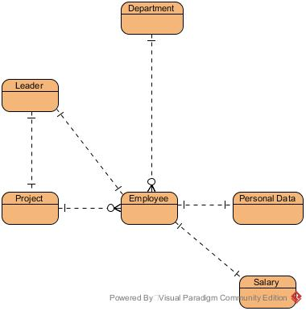
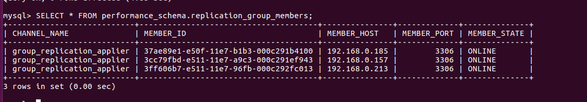

# Sprawozdanie

Jakub Dymon, Paweł Nowacki, Paweł Sulżycki

## Wstęp

### Cele projektu

Celem projektu jest stworzenie aplikacji internetowej na potrzeby działu kadr przedsiębiorstwa. Przedsiębiorstwo posiada trzy lokalizacje, a w każdej z nich znajduje się dział kadr, który potrzebuje dostępu do danych o wszystkich pracownikach firmy. Wszystkie lokalizacje są równorzędne i potrzebują zarówno odczytywać, jak i edytować dane pracowników.

### Założenia projektowe

System pozwala na dodawanie i usuwanie pracowników, przeglądanie i edycję danych osobowych pracowników i zależności hierarchicznych pomiędzy nimi. Ponadto system replikacji bazy danych pozwala na obsługę systemu z różnych oddziałów firmy rozsianych po całym świecie. System ma formę aplikacji internetowej z systemem logowania i jest dostępny dla odpowiednio przeszkolonych pracowników działu kadr. Konta użytkowników są zakładane odgórnie przez administratora.

Aplikacja wykorzystuje relacyjną bazę danych MySQL oraz logikę biznesową zaimplementowaną z użyciem języka Java i biblioteki Spring Framework oraz pochodnych. Każda instancja aplikacji posiada własną bazę danych o takich samej zawartości i jest dobierana na podstawie lokalizacji. Stosowana jest replikacja  migawkowa typu multimaster na poziomie bazy danych i służy propagacji danych pomiędzy różnymi instancjami tej samej aplikacji. Kontroli wersji danych służy mechanizm *optimistic locking*.

### Zakres projektu

## Replikacja w systemie baz danych MySQL

## Model konceptualny i fizyczny baz danych

### Model konceptualny



## Implementacja baz danych w środowisku MySQL

### Opis implementacji mechanizmu replikacyjnego multi-master

Implementację mechanizmu replikacyjnego rozpoczęto od przygotowania odpowiedniego środowiska, na którym będzie działać baza danych.

#### Przygotowanie środowiska

1. Instalacja VMware Workstation 14 Player na urządzeniu - hoscie z systemem Windows
2. Instalacja maszyny wirtualnej z systemem Ubuntu 16.04 LTS
3. Instalacja najnowszej wersji MySQL.
4. Powielenie maszyny wirtualnej, tak aby otrzymać łącznie 3 maszyny.
5. Konfiguracja wirtualnej sieci lokalnej w celu umożliwienia komunikacji między maszynami. 

#### Konfiguracja maszyn wirtualnych

Kolejnym krokiem było konfiguracja maszyn wirtualnych w celu umożliwienia replikacji.

1. Dla każdej z maszyn wygenerowano unikalne ID grupy przy użyciu komendy

    ```
    uuidgen
    ```
     oraz sprawdzono adres IP maszyn przy użyciu
    ```
    ifconfig
    ```
     Zapisane dane potrzebne będą do dalszej konfiguracji.

2. Następnie utworzono pliki konfiguracyjne przy użyciu komendy 

    ```
    sudo gedit /etc/mysql/my.cnf
    ```

3. Wypełnienie pliku konfiguracyjnego bazy danych według poniższego szablonu: 

    ```
    !includedir /etc/mysql/conf.d/
    !includedir /etc/mysql/mysql.conf.d/

    [mysqld]

    # General replication settings
    gtid_mode = ON
    enforce_gtid_consistency = ON
    master_info_repository = TABLE
    relay_log_info_repository = TABLE
    binlog_checksum = NONE
    log_slave_updates = ON
    log_bin = binlog
    binlog_format = ROW
    transaction_write_set_extraction = XXHASH64
    loose-group_replication_bootstrap_group = OFF
    loose-group_replication_start_on_boot = OFF
    loose-group_replication_ssl_mode = REQUIRED
    loose-group_replication_recovery_use_ssl = 1

    # Shared replication group configuration
    loose-group_replication_group_name = [wygenerowany id grupy]
    loose-group_replication_ip_whitelist = [ip serwerów oddzielone ","]
    loose-group_replication_group_seeds = [ip serwerów z portem 33061 oddzielone ","]

    # Single or Multi-primary mode? Uncomment these two lines
    # for multi-primary mode, where any host can accept writes
    loose-group_replication_single_primary_mode = OFF
    loose-group_replication_enforce_update_everywhere_checks = ON

    # Host specific replication configuration
    server_id = [id serwera]
    bind-address = [ip serwera]
    report_host = [ip serwera]
    loose-group_replication_local_address = [ip serwera]:33061
    ```

4. Po zapisaniu pliku konfiguracyjnego należało zrestartować bazę danych przy użyciu komendy 

    ```
    sudo systemctl restart mysql
    ```

5. Kolejnym krokiem było dodanie wyjątków do zapory sytemowej:
    ```
    sudo ufw allow 33061
    ```

#### Konfiguracja wewnątrz MySQL

1. Po zalogowaniu się do bazy danych kolejnymi krokami były:

2. Utworzenie użytkownika bazy danych odpowiedzialnego za replikację

3. Instalacja pluginu umożliwiającego obsługę replikacji.

4. Po pomyślnej instalacji mechanizm replikacji był już praktycznie gotowy. Pozostało tylko utworzyć grupę baz danych:

    ```
    SET GLOBAL group_replication_bootstrap_group=ON;
    START GROUP_REPLICATION;
    SET GLOBAL group_replication_bootstrap_group=OFF;
    ```

5. Ostatnim krokiem było wystartowanie replikacji na pozostałych maszynach: 

    ```
    START GROUP_REPLICATION;
    ```

Poniżej widoczna jest tabela prezentująca bazy danych połączone w grupę replikacji:



Prezentacja działania mechanizmu replikacji dostępna jest w formie wideo pod adresem: [https://youtu.be/CZzqGOR5zJk](https://youtu.be/CZzqGOR5zJk).

## Projekt i implementacja aplikacji klienckiej

### Funkcje aplikacji - diagram przypadków użycia

### Realizacja wybranych funkcjonalności

## Wdrożenie i testowanie aplikacji

## Podsumowanie

## Literatura

- https://dev.mysql.com/doc/refman/5.7/en/mysql-cluster-replication-multi-master.html
- https://docs.spring.io/spring/docs/5.0.1.RELEASE/spring-framework-reference/core.html#spring-core
- http://docs.spring.io/spring-data/jpa/docs/1.10.4.RELEASE/reference/html/
